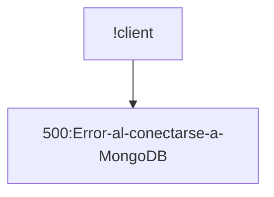
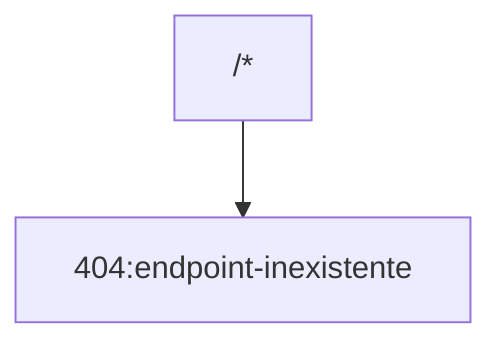
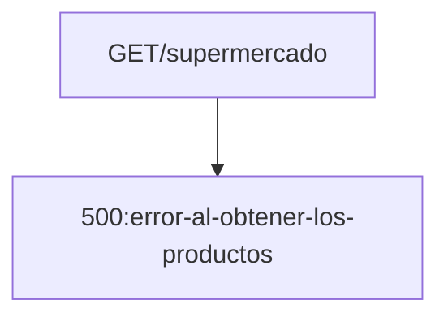
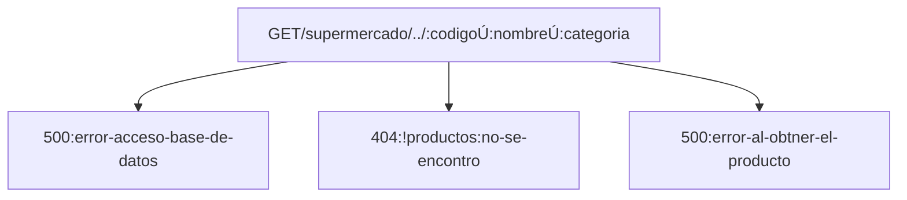
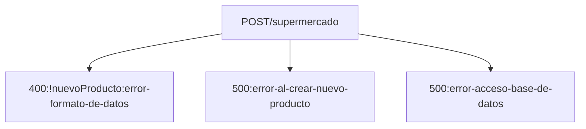
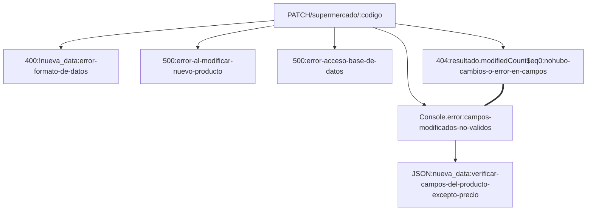

<!-- La misma, deberá incluir los siguientes puntos:
1. Construir una introducción al proyecto backend de frutas:
a. debes detallar al inicio de la documentación la URL base http://localhost:3008/api/v1/
b. deberás crear un ejemplo de uso de cada uno de los métodos GET - POST - PUT - DELETE
c. incluye un ejemplo de código del cuerpo del mensaje para los métodos POST - PUT
d. no incluyas el método PATCH si es que lo construiste oportunamente
e. incluye un ejemplo del archivo .env para explicar cómo definir la conexión a MongoDB
f. no es necesario incluir el nivel de seguridad de la API vía JWT
1. debes integrar en la creación de esta documentación:
a. títulos y subtítulos, más formateo estándar de párrafos con Markdown
b. integrar un sumario en el encabezado del documento Markdown
c. una tabla general que represente los endpoint a utilizar y la ruta base de cada uno
d. utilizar el formato código, para representar los bloques de código de ejemplo
e. al menos un gráfico construído con Markdown, en la sección que consideres apropiada
1. postear todo en Github de forma pública. Compartir el link de acceso a tu trabajo práctico.  -->

# URL BASE
### http//:localhost:3008/supermercado
> PORT ----  por defecto 3008 || 3000


# SUMARIO

- [URL BASE](#url-base)
    - [http//:localhost:3008/supermercado](#httplocalhost3008supermercado)
- [SUMARIO](#sumario)
  - [Introduccion](#introduccion)
  - [EndPoints](#endpoints)
  - [Codigos de PUT y POST](#codigos-de-put-y-post)
  - [Variables de Entorno (.Env)](#variables-de-entorno-env)
  - [Mensajes de Error](#mensajes-de-error)


## Introduccion

Es una API REST de un supermercado. Proporciona respuestas con recursos en formato JSON. Permite agregar , modificar o eliminar recursos. 

## EndPoints

|PETICION |URL |DESCRIPCION|
--- | --- | ---|
|GET|http://localhost:3008/|ruta raiz . Devuelve msj de bienvenida|
|GET|http://localhost:3008/supermercado|obtener todos los productos|
|GET|http://localhost:3008/supermercado/:codigo|obtener un producto por su codigo|
|GET|http://localhost:3008/supermercado/nombre/:nombre|obtener uno o más productos por parte de su nombre.Tener presente que un usuario puede enviar un parámetro en minúsculas o mayusculas o ambos.|
|GET|http://localhost:3008/supermercado/categoria/:categoria|obtener todos los productos de una categoría específica. Tiene que ser exacta|
|POST|http://localhost:3008/supermercado|crear un nuevo producto|
|PATCH|http://localhost:3008/supermercado/:codigo|modificar el precio de un producto. Solo podrás modificar el precio del producto, no sus otros parámetros|
|DELETE|http://localhost:3008/supermercado/:codigo|Elimina un producto. Informar el codigo|


Formato de los PRODUCTOS en la Base de Datos :

```json
{
    "_id": "64aecb55b350f28768d3eb42",
    "codigo": 9012,
    "nombre": "Detergente",
    "precio": 8.75,
    "categoria": "Limpieza"
  }
```

>Ejemplo PATCH : 
>>si se envia la peticion PATCH y se modificaron los campos invalidos :
>>>No se pudo modificar o no hubo cambios.
>>>Verificar campos modificados
>>>Ver error en el log
>>>Status: 404 Not Found Size: 88 Bytes Time: 1.25 s
>
>
>>>NO se pueden modificar estos campos
>>>codigo|nombre|categoria : 9012 | Detergente | Limpieza
>>>Desconectado de MongoDB

## Codigos de PUT y POST
```javascript
app.post("/supermercado", async (req, res) => {
  const nuevoProducto = req.body;
  try {
    if (nuevoProducto === undefined) {
      res.status(400).send("Error en el formato de datos a crear.");
    }

    // Conexión a la base de datos
    const client = await connectToDB();
    if (!client) {
      res.status(500).send("Error al conectarse a MongoDB");
    }

    const db = client.db(BASE_DE_DATOS);
    const collection = db.collection(COLECCION);
    await collection.insertOne(nuevoProducto);
    console.log("Nuevo producto creado");
    res.status(201).send(nuevoProducto);
  } catch (error) {
    // Manejo de errores al agregar el producto
    res.status(500).send("Error al intentar agregar un nuevo producto");
  } finally {
    // Desconexión de la base de datos
    await disconnectFromMongoDB();
  }
});
```

## Variables de Entorno (.Env)

```javascript
PORT=3008
MONGODB_URLSTRING=mongodb+srv://<usuario>:<password>@cluster0.jlra35f.mongodb.net/?retryWrites=true&w=majority

MONGODB_DATABASE="supermercado"

MONGODB_COLECCION="supermercado"
```

Utiliza   ***MONGODB_DATABASE***    y    ***MONGODB_COLECCION***    para modificar la base de datos a la que acceder

>crea un archivo .env en la raiz de tu Proyecto y agrega tus variables


## Mensajes de Error












